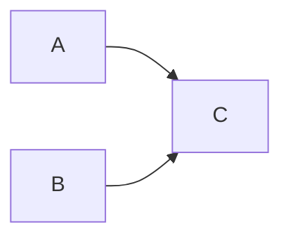

# CausCell: Causal disentanglement for single-cell representations and controllable generation
## Introduction 
This repository hosts the official implementation of CausCell, a method that can disentangle single-cell data into various concept based on pre-defined causal structure between underlying concepts. Additionally, CausCell can be used for counterfactual generation in single-cell data, while the counterfactual generated cells are consistent with the realistic scenarios.

## Example data
We have made available the code necessary to generate example data, serving as a practical illustration for training and testing the CausCell model. 
```python
python ./Data/GeneratingExampleData.py
```
In the example datasets, it contains 3 concepts and there are 4, 4, 3 concept values for each concept, respectively. The causal structure between these three concepts are defined as follows:


## Core API interface for model training
Using this API, you can train CausCell on your own datasets using a few lines of code. 
```python
from causcell import CausCell

# set up a CausCell model
model = CausCell(save_and_sample_every=10)

# using the example data generated from ./Data/GenerationExampleData.py
# load its concept list, concept value counts and causal structure between concepts
concept_list = ['concept_A','concept_B','concept_C']
concept_counts = [4, 4, 3]
concept_cdag = [[0,0,0,0],[0,0,0,0],[1,1,0,0],[0,0,0,0]]

# set up an output directory of model training
results_folder = "./Output"

# train dataset format transformation for CausCell training
transformed_train_data = model.data_transformation(data_pwd="./Data/example_train.h5ad", 
                                                   save_pwd="./Data", 
                                                   concept_list=concept_list)

# model training
model.train(training_data_pwd="./Data/transformed_example_train.h5ad", 
            model_save_pwd="./Output", 
            concept_list=concept_list, concept_counts=concept_counts, concept_cdag=concept_cdag, 
            training_num_steps=100)
```

## Core API interface for concept disentanglement
Using this API, you can obtain the concept representations and reconstructed cells in test dataset using a few lines of code. 
```python
from causcell import CausCell

# set up a CausCell model
model = CausCell()

# using the example data generated from ./Data/GenerationExampleData.py
# load its concept list, concept value counts and causal structure between concepts
concept_list = ['concept_A','concept_B','concept_C']
concept_counts = [4, 4, 3]
concept_cdag = [[0,0,0,0],[0,0,0,0],[1,1,0,0],[0,0,0,0]]

# set up an output directory of results
results_folder = "./Output"

# load trained model parameters from previous training
model.load_trained(concept_list=concept_list, concept_counts=concept_counts, concept_cdag=concept_cdag, 
                   results_folder=results_folder, 
                   trained_profile_size=1000, 
                   milestone=10)

# test dataset format transformation for CausCell training
transformed_test_data = model.data_transformation(data_pwd="./Data/example_test.h5ad", 
                                                   save_pwd="./Data", 
                                                   concept_list=concept_list)
# set up the path of transformed test dataset
testing_data_pwd = "./Data/transformed_example_test.h5ad"

# obtained the concept representations of all cells in test dataset
concept_embs = model.disentanglement(testing_data_pwd=testing_data_pwd, 
                                     saved_pwd="./Output", 
                                     concept_list=concept_list, concept_counts=concept_counts, concept_cdag=concept_cdag)

# obtained the reconstructed gene expression profiles of all cells in test dataset
generated_cells = model.get_generated_cells(testing_data_pwd=testing_data_pwd, saved_pwd="./Output", 
                                            concept_list=concept_list, concept_counts=concept_counts, concept_cdag=concept_cdag)
```
## Core API interface for counterfactual generation
Using this API, you can load trained CausCell and perform counterfactual generation using a few lines of code. 
```python
from causcell import CausCell

# set up a CausCell model
model = CausCell()

# using the example data generated from ./Data/GenerationExampleData.py
# load its concept list, concept value counts and causal structure between concepts
concept_list = ['concept_A','concept_B','concept_C']
concept_counts = [4, 4, 3]
concept_cdag = [[0,0,0,0],[0,0,0,0],[1,1,0,0],[0,0,0,0]]

# set up an output directory of model training
results_folder = "./Output"

# load trained model parameters from previous training
model.load_trained(concept_list=concept_list, concept_counts=concept_counts, concept_cdag=concept_cdag, 
                   results_folder=results_folder, 
                   trained_profile_size=1000, 
                   milestone=10)

# set up counterfactual intervention targets
multi_target_list = [
    {"target_factor": "concept_A", "ref_factor_value":"A", "tgt_factor_value": "B"}, 
    {"target_factor": "concept_B", "ref_factor_value":"q", "tgt_factor_value": "r"}, 
]

# obtain the counterfactual generated cells based on the intervened concepts
counterfactual_generated_cells = model.counterfactual_generation(data_pwd="./Data/example_train.h5ad", 
                                                                 save_pwd='./Output', 
                                                                 concept_list=concept_list, concept_counts=concept_counts, concept_cdag=concept_cdag, 
                                                                 multi_target_list=multi_target_list, 
                                                                 file_name="Counterfactual_generated_cells")
```
